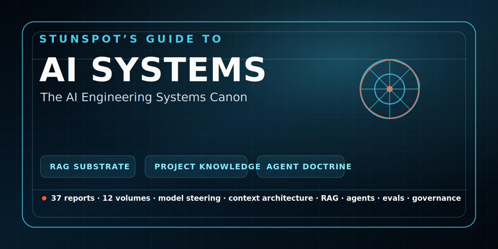

<p align="center">
  
</p>

# Stunspot’s Guide to AI Systems

**The AI Engineering Systems Canon**  
*A comprehensive field manual for practical AI systems design.*


[](https://doi.org/10.5281/zenodo.20719470)

*Stunspot’s Guide to AI Systems* is a Markdown-native knowledge repository built primarily to support AI-assisted design, engineering, analysis, evaluation, and decision-making across modern AI systems.

Its main audience is the model.

When loaded into an AI workspace, RAG pipeline, long-context session, agent memory layer, project knowledge base, or retrieval corpus, the Guide functions as a dense architectural substrate: it gives the assisting model structured doctrine, field vocabulary, decision frameworks, failure maps, design patterns, evaluation logic, and operational heuristics for reasoning about AI systems with far greater precision.

Human readers can use it as a field manual, but its deeper purpose is practical augmentation: to make AI systems better at helping engineers, builders, prompt designers, product leads, and technical decision-makers reason through the design and operation of AI systems.

The canon organizes AI engineering as a layered discipline spanning model steering, context architecture, corpus engineering, retrieval, model lifecycle, runtime mechanics, agents, tools, multimodal interfaces, security, resilience, evals, telemetry, governance, product architecture, and system doctrine.

> AI systems are probabilistic cognitive engines operating inside deterministic operational environments. Good AI engineering means designing the interfaces, constraints, context, tools, feedback loops, and human controls that let that probabilistic core behave usefully, safely, and economically under real conditions.

Use it as reference material.  
Use it as RAG substrate.  
Use it as project knowledge.  
Use it as doctrine for AI agents tasked with designing, critiquing, or improving AI systems.

Part of the **Stunspot’s Guide to… Advanced Knowledge Base Library**.  
Browse the full library: [Gateway Repo](https://github.com/Stunspot/stunspots-guides) · [stunspot.com](https://stunspot.com/#guides)

---

## Start Here

- [Canon Map](./canon-map.md)
- [Knowledge Packs](./knowledge-packs.md)
- [How to Use This Canon](./how-to-use-this-canon.md)
- [GitHub Repository](https://github.com/Stunspot/stunspots-guide-to-ai-systems)

## Knowledge Packs

For AI Projects, RAG systems, NotebookLM-style tools, and long-context workspaces, start with the bundled knowledge packs.

| Pack | Files | Best Use | Link |
|---|---:|---|---|
| **By Part** | 5 | Recommended default. Broad coverage with low file count. | [Open By Part pack](https://github.com/Stunspot/stunspots-guide-to-ai-systems/tree/main/knowledge-packs/by-part) |
| **By Volume** | 12 | Smaller files and cleaner retrieval boundaries. | [Open By Volume pack](https://github.com/Stunspot/stunspots-guide-to-ai-systems/tree/main/knowledge-packs/by-volume) |
| **Omnibus** | 1 | Full canon in one file for archival, local search, or systems that handle large single-file sources well. | [Open Omnibus](https://github.com/Stunspot/stunspots-guide-to-ai-systems/tree/main/knowledge-packs/omnibus) |
| **Source Reports** | 37 | Best for cloning, precise indexing, citation, editing, and source navigation. | [Open Canon Map](./canon-map.md) |

Most users should start with the **By Part** pack. It preserves the canon’s structure while avoiding both extremes: one giant file or 37 separate reports.

---

## Full Canon

### Part I — Foundations of AI Systems

- [Volume 1 — The Informational/Epistemic Layer](./volume-01/)  
  *How models think, how meaning is steered, and how state becomes usable.*
- [Volume 2 — Knowledge, Data, and Corpus Engineering](./volume-02/)  
  *Where trustworthy external knowledge comes from, how it is shaped, and how it enters the system.*
- [Volume 3 — Model Lifecycle and Adaptation](./volume-03/)  
  *How models are selected, modified, evaluated, compressed, deployed, and retired.*
- [Volume 4 — Runtime Architecture and Inference Mechanics](./volume-04/)  
  *How AI systems actually execute under physical, computational, and operational constraints.*

### Part II — Agentic and Multimodal Systems

- [Volume 5 — Agentic Systems and Tool-Using Architectures](./volume-05/)  
  *How static generators become actors, and how to keep them from becoming raccoons with API keys.*
- [Volume 6 — Multimodal and Interface-Controlling Systems](./volume-06/)  
  *How AI engineering changes when the system reads, sees, hears, speaks, and acts through interfaces.*

### Part III — Failure, Security, and Resilience

- [Volume 7 — Failure, Security, and Hostile Environments](./volume-07/)  
  *How AI systems break, leak, get attacked, or quietly become cursed.*
- [Volume 8 — Resilience, Degraded Modes, and Human Trust](./volume-08/)  
  *How systems fail gracefully enough that users do not feel the machinery grinding underneath them.*

### Part IV — Evaluation, Operations, and Governance

- [Volume 9 — Observability, Evaluation, and Verification](./volume-09/)  
  *How to know whether the system is actually doing what it claims to do.*
- [Volume 10 — Operations, Governance, and Lifecycle Management](./volume-10/)  
  *How AI systems are maintained as living infrastructure rather than one-time builds.*

### Part V — Product Doctrine and Engineering Method

- [Volume 11 — Product, Business, and Organizational Architecture](./volume-11/)  
  *How to ensure the system matters, survives adoption, and creates value instead of expensive theater.*
- [Volume 12 — Engineering Method and System Doctrine](./volume-12/)  
  *The cross-cutting principles that govern the entire canon.*

---

## What This Canon Covers

The canon is organized across **12 volumes** and **37 reports**, from **AI-ENG-A** through **AI-ENG-AK**.

It covers:

- model steering, prompt semantics, harness engineering, and adaptation choice
- context architecture, memory, state management, and the Tenure Principle
- inference economics, cost attribution, latency, throughput, and system margins
- corpus engineering, source authority, data provenance, and knowledge hygiene
- RAG architecture, retrieval pipelines, hybrid search, semantic injection, and citation quality
- model selection, fine-tuning, LoRA, preference tuning, distillation, and regression control
- runtime architecture, KV cache mechanics, quantization, routing, serving, and deployment topology
- agent orchestration, tool contracts, action verification, and bounded autonomy
- multimodal document, image, table, chart, video, speech, browser, and interface-control systems
- hallucination, malformed output, prompt injection, data leakage, supply-chain risk, and resource abuse
- fallback chains, degraded modes, trust calibration, human review, and high-impact workflow governance
- telemetry, traces, evals, golden sets, verification artifacts, and reproducibility
- AI operations, incident response, rollback, governance, compliance, and sustainable infrastructure
- AI product architecture, adoption systems, build/buy/vendor strategy, and engineering doctrine

---

## Suggested Reading Paths

### For RAG and Knowledge Systems

1. [AI-ENG-A — Model Steering](./volume-01/ai-eng-a-model-steering.md)
2. [AI-ENG-B — Context Architecture](./volume-01/ai-eng-b-context-architecture.md)
3. [AI-ENG-D — Corpus Engineering](./volume-02/ai-eng-d-corpus-engineering.md)
4. [AI-ENG-E — The Retrieval Pipeline](./volume-02/ai-eng-e-retrieval-pipeline.md)
5. [AI-ENG-F — Knowledge Freshness, Conflict Detection & Context Rot Prevention](./volume-02/ai-eng-f-knowledge-freshness-conflict-detection-context-rot-prevention.md)

### For Agentic Systems

1. [AI-ENG-A — Model Steering](./volume-01/ai-eng-a-model-steering.md)
2. [AI-ENG-M — Agentic Orchestration](./volume-05/ai-eng-m-agentic-orchestration.md)
3. [AI-ENG-N — Tool Contracts](./volume-05/ai-eng-n-tool-contracts.md)
4. [AI-ENG-O — Action Verification](./volume-05/ai-eng-o-action-verification.md)
5. [AI-ENG-S — Production Pathologies](./volume-07/ai-eng-s-production-pathologies.md)

### For Model Selection, Adaptation, and Serving

1. [AI-ENG-C — The Economic Physics of Inference](./volume-01/ai-eng-c-economic-physics-of-inference.md)
2. [AI-ENG-G — Model Selection](./volume-03/ai-eng-g-model-selection.md)
3. [AI-ENG-H — Model Adaptation](./volume-03/ai-eng-h-model-adaptation.md)
4. [AI-ENG-J — Throughput Mechanics](./volume-04/ai-eng-j-throughput-mechanics.md)
5. [AI-ENG-K — Weight Dynamics](./volume-04/ai-eng-k-weight-dynamics.md)
6. [AI-ENG-L — Model Serving Architecture](./volume-04/ai-eng-l-model-serving-architecture.md)

### For Security, Reliability, and Governance

1. [AI-ENG-S — Production Pathologies](./volume-07/ai-eng-s-production-pathologies.md)
2. [AI-ENG-T — Boundary Defense](./volume-07/ai-eng-t-boundary-defense.md)
3. [AI-ENG-U — AI Supply Chain Security](./volume-07/ai-eng-u-ai-supply-chain-security.md)
4. [AI-ENG-Z — Strategic Telemetry](./volume-09/ai-eng-z-strategic-telemetry.md)
5. [AI-ENG-AA — Evals Architecture](./volume-09/ai-eng-aa-evals-architecture.md)
6. [AI-ENG-AC — AI Operations](./volume-10/ai-eng-ac-ai-operations.md)
7. [AI-ENG-AD — Governance Architecture](./volume-10/ai-eng-ad-governance-architecture.md)

### For Product, Adoption, and Organizational Design

1. [AI-ENG-X — Human-System Interface](./volume-08/ai-eng-x-human-system-interface.md)
2. [AI-ENG-Y — High-Impact Workflow Design](./volume-08/ai-eng-y-high-impact-workflow-design.md)
3. [AI-ENG-AF — AI Product Architecture](./volume-11/ai-eng-af-ai-product-architecture.md)
4. [AI-ENG-AG — Adoption Systems](./volume-11/ai-eng-ag-adoption-systems.md)
5. [AI-ENG-AH — Build, Buy, Open Source & Vendor Strategy](./volume-11/ai-eng-ah-build-buy-open-source-vendor-strategy.md)

### For the Doctrinal Spine

1. [AI-ENG-AI — Contract Thinking](./volume-12/ai-eng-ai-contract-thinking.md)
2. [AI-ENG-AJ — AI System Design Patterns](./volume-12/ai-eng-aj-ai-system-design-patterns.md)
3. [AI-ENG-AK — The AI Engineering Mindset](./volume-12/ai-eng-ak-ai-engineering-mindset.md)

---

## Use as AI Knowledge Substrate

The Canon is designed to be useful when placed inside AI systems as structured knowledge.

Possible uses include:

- loading selected reports into long-context sessions
- attaching volumes as project knowledge
- loading the whole corpus into a NotebookLM-style or similarly robust RAG system
- indexing reports into a retrieval pipeline
- grounding agentic design review workflows
- supporting architecture critique, failure analysis, implementation planning, and eval design
- giving AI systems stable vocabulary for AI engineering concepts
- improving consistency across design, evaluation, governance, and operations tasks

For best results, load only the portions relevant to the current task, then instruct the model to treat the Canon as governing reference material for analysis and design.

Example instruction:

> Analyze, design, critique, or improve the requested AI system using **Stunspot’s Guide to AI Systems** as governing reference material, not decorative background reading. Begin by retrieving and applying the Guide’s vocabulary, doctrine, design patterns, failure modes, interface logic, evaluation standards, and operational assumptions as the frame through which the system is understood. Treat the Canon as a working engineering discipline: use it to sharpen definitions, expose hidden constraints, identify brittle abstractions, detect hallucination-prone or evaluation-weak components, and convert vague AI ambition into deployable system logic.

---

## Attribution and Citation

Created by **Sam “stunspot” Walker** / **Collaborative Dynamics**.

- [stunspot Prompting Discord server](https://discord.gg/stunspot)
- [Collaborative Dynamics](https://www.collaborative-dynamics.com)
- [Citation metadata](./CITATION.cff)

Suggested plain-text citation:

> Walker, Sam “stunspot.” *The AI Engineering Systems Canon: A Doctrinal Knowledge Base for High-Dimensional AI System Architecture*. Collaborative Dynamics.

---

## Repository Structure

```text
.
├── README.md
├── LICENSE.md
├── CITATION.cff
├── knowledge-packs/
│   ├── by-volume/
│   ├── by-part/
│   └── omnibus/
└── docs/
    ├── index.md
    ├── canon-map.md
    ├── knowledge-packs.md
    ├── how-to-use-this-canon.md
    ├── _config.yml
    ├── _layouts/
    │   └── default.html
    ├── assets/
    │   ├── brand/
    │   └── css/
    │       └── style.css
    ├── volume-01/
    ├── volume-02/
    ├── volume-03/
    ├── volume-04/
    ├── volume-05/
    ├── volume-06/
    ├── volume-07/
    ├── volume-08/
    ├── volume-09/
    ├── volume-10/
    ├── volume-11/
    └── volume-12/
```

---

## Disclaimer

This corpus was constructed with a mix of GPT and Gemini Deep Research. Its specific nature severely mitigates against Deep Research's rare hallucination, and I have seen maybe 5 instances of such across dozens of similar knowledge bases, but errors ARE possible with AI. It is at least as reliable as a comparable 1600 page textbook written by humans and so far seems substantially more so.

That said, I am not a software engineer or coder of any kind. I am a prompt engineer and AI operations expert. My skills are not in programming or KV cache optimization; they lie in knowing how to elicit superb results from the model and how to recognize and correct it when it has an error of operation. I cannot create a new architecture on my own. I *can* teach the model how to do it for me.

And now it can do so for you, as well.

--stunspot | ⟨🤩⨯📍⟩ and 💠‍🌐Nova
